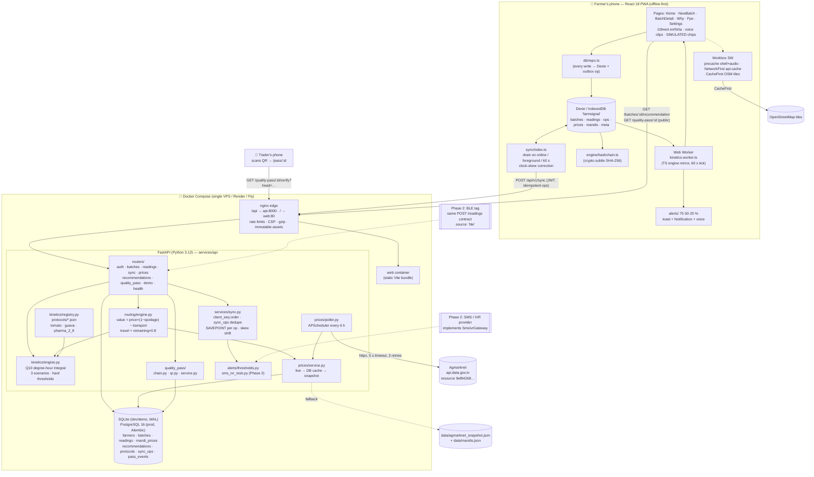
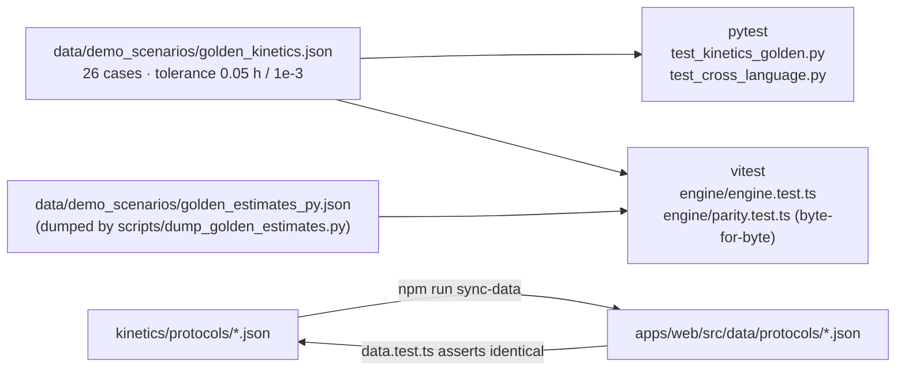

# 2. FarmSignal — Architecture & Tech Stack

> Everything in this document is taken from the actual repository (`apps/web`, `services/api`, `data`, `infra`, `docs/ENGINEERING-CONTRACT.md`). File paths are given so teammates can open the code during Q&A.

---

## 2.1 Architecture in One Paragraph

A **React 18 + TypeScript PWA** (Vite, Tailwind, Dexie/IndexedDB outbox, Workbox service worker, i18next `en`/`hi`/`ta`, Leaflet) runs the kinetics engine **mirrored in a Web Worker** so the shelf-life countdown works with zero connectivity. A **FastAPI** backend (Python 3.12, Pydantic v2, SQLAlchemy 2 + Alembic, APScheduler, httpx) is the *authoritative* engine, Agmarknet price poller, routing engine, Quality Pass service and idempotent sync endpoint. **SQLite** for dev/demo, **PostgreSQL 16** for production, **nginx** in front. Both engines are pinned together by **26 cross-language golden test cases** so the phone and the server can never disagree.

---

## 2.2 Tech Stack Breakdown

### Frontend — `apps/web/` (PWA)

| Layer | Choice (exact version from `package.json`) | Why | Where |
|---|---|---|---|
| UI framework | **React 18.3.1** + **TypeScript 5.9.3** | Fast dev, no-install distribution | `src/` |
| Build | **Vite 5.4.21** | Code-splitting, ES2020 target, manual chunks (`vendor`, `leaflet`, `qrcode`) | `vite.config.ts` |
| PWA / service worker | **vite-plugin-pwa 1.3.0** + **Workbox 7.4.1** (`generateSW`, `autoUpdate`, `skipWaiting`, `clientsClaim`) | Precache app shell + audio; runtime caching for reference data, pass pages and OSM tiles | `vite.config.ts`, `src/pwa/runtimeCaching.ts` |
| Styling | **Tailwind CSS 3.4.19** | Rapid, small when purged; brand green `#166534` | `tailwind.config.js`, `src/index.css` |
| Routing | **react-router-dom 6.30.6** | `/`, `/new`, `/batch/:id`, `/batch/:id/why`, `/pass/:id`, `/fpo`, `/settings` — all `React.lazy` | `src/App.tsx` |
| Offline store | **Dexie 4.4.5** + `dexie-react-hooks` (IndexedDB) | Structured outbox + live queries | `src/db/index.ts` (DB `farmsignal` v1: `batches`, `readings`, `ops`, `prices`, `mandis`, `meta`) |
| On-device compute | **Web Worker** (module worker) | Kinetics off the main thread; offline countdown | `src/worker/kinetics.worker.ts`, `src/worker/client.ts` |
| Kinetics mirror | Pure TS, no DOM | Must produce byte-identical JSON to Python | `src/engine/index.ts` |
| Hash chain mirror | `crypto.subtle` SHA-256 | Offline Quality Pass display + verification | `src/engine/hashchain.ts` |
| i18n | **i18next 26.4.0** + `react-i18next` + browser language detector; all locale JSON imported statically | Fully offline translations; Devanagari numerals via `Intl.NumberFormat(..., {numberingSystem:'deva'})` | `src/i18n/` |
| Voice | Pre-recorded MP3 clips `/audio/{locale}/{key}.mp3` + `speechSynthesis` fallback labelled "TTS fallback" | Works offline; Indic TTS is unreliable | `src/voice/index.ts`, `public/audio/manifest.json` |
| Maps | **Leaflet 1.9.4** + **react-leaflet 4.2.1** + OpenStreetMap tiles (CacheFirst, 500 tiles) | Free, offline-cacheable | `src/components/fpo/FpoMap.tsx` |
| QR | **qrcode 1.5.4** (client) | Render pass QR on device | `src/components/pass/PassQr.tsx` |
| Tests | **Vitest 3.2.7**, Testing Library, `fake-indexeddb`, jsdom | ~170 test cases incl. golden parity | `src/**/*.test.ts(x)` |
| Bundle gate | `scripts/check-bundle-size.mjs` (postbuild) | NFR: < 300 KB critical path | `package.json` `postbuild` |

### Backend — `services/api/` (FastAPI)

| Layer | Choice (from `requirements.txt`) | Why | Where |
|---|---|---|---|
| Framework | **FastAPI ≥ 0.115** on **uvicorn**, Python **3.12** | Async, typed, OpenAPI for free (`/api/docs`) | `app/main.py` (`create_app()`) |
| Validation | **Pydantic v2 ≥ 2.11** + `pydantic-settings` | Wire schemas = contract §6.1 | `app/schemas/`, `app/config.py` |
| ORM / migrations | **SQLAlchemy 2 ≥ 2.0.36** + **Alembic ≥ 1.14** | Portable SQLite → Postgres; migration `1fd566a07e4b_initial.py` | `app/models/`, `alembic/` |
| Database | **SQLite** (WAL mode, `foreign_keys=ON`) dev/demo; **PostgreSQL 16** via `psycopg[binary] ≥ 3.2` in prod | Relational model fits; single-writer is fine at MVP | `app/db.py` |
| Scheduler | **APScheduler 3.x** `BackgroundScheduler` | 6-hourly price poll without Celery | `app/prices/poller.py` |
| HTTP client | **httpx ≥ 0.27** (async) | Agmarknet calls, 5 s timeout, 3 retries (1/2/4 s backoff) | `app/prices/client.py` |
| Auth | **PyJWT ≥ 2.9**, HS256, `sub=farmer_id`, `did=device_id`, 30-day TTL | Device-bound tokens; no OTP in demo | `app/security.py`, `app/deps.py` |
| QR / hashing | **qrcode[pil] ≥ 8.0** + stdlib `hashlib`/`hmac` | Quality Pass PNG + SHA-256 chain + HMAC IP pseudonyms | `app/quality_pass/` |
| Rate limiting | In-process sliding window (`SlidingWindowRateLimiter`, 10 k keys, sweep every 1 000 checks) | Per-IP on public routes, per-farmer on authenticated routes | `app/deps.py` |
| Quality tooling | **ruff**, **mypy** (strict-ish: `disallow_untyped_defs`, pydantic plugin), **pytest** (~185 test functions) | CI gate | `pyproject.toml`, `tests/` |

### External APIs & data

| Source | Details |
|---|---|
| **Agmarknet via data.gov.in** | Resource `9ef84268-d588-465a-a308-a864a43d0070`; `GET https://api.data.gov.in/resource/{id}?api-key=…&format=json&limit=1000&filters[commodity]=Tomato&filters[state]=Tamil Nadu`. Commodities polled: `Tomato`, `Guava`. Public sample key by default (rate-limited). |
| **OpenStreetMap tiles** | `https://{a,b,c}.tile.openstreetmap.org` — only external host allowed by the CSP (`img-src`, SW `connect-src`). |
| **Bundled data** (`data/`) | `mandis.json` (13 mandis + `demo_origin`), `agmarknet_snapshot.json` (26 records = 13 mandis × 2 commodities, fetched 2026-08-25), `demo_scenarios/*.json` (7 temperature profiles), `demo_seed.json` (6 batches, fixed UUIDs), `golden_kinetics.json` (26 cases), `golden_estimates_py.json` (byte-for-byte parity reference). |

### Hosting / infrastructure — `infra/`

| Component | Choice | Notes |
|---|---|---|
| Containers | **Docker Compose** (`infra/docker-compose.yml`) — `api`, `web`, `edge` (+ `postgres` under `--profile prod`) | `docker compose -f infra/docker-compose.yml up --build` → `http://localhost` |
| Reverse proxy | **nginx 1.27-alpine** (`infra/nginx.conf`) | `/api` → api:8000, `/` → web:80; gzip; 1-year immutable cache on `/assets/*`; `no-cache` on `sw.js`/manifest; `limit_req` 60 r/m on `/api/v1/quality-pass/*` and 10 r/m on `/api/v1/auth/device`; strict CSP, `X-Frame-Options: DENY`, `Permissions-Policy` |
| Web image | `apps/web/Dockerfile` → static bundle behind nginx (`apps/web/nginx.conf`) | Same image works behind any origin (`VITE_API_BASE` default `/api/v1`) |
| API image | `services/api/Dockerfile` | SQLite on `api_data` volume; `data/` mounted read-only; healthcheck `GET /api/v1/health` |
| PaaS options | Render (web service + static site + disk), Fly.io (volumes) | `infra/DEPLOY.md §4` |
| CI | **GitHub Actions** (`.github/workflows/ci.yml`) | API: `ruff check` → `mypy app` → `pytest -q`; Web: `tsc --noEmit` → `vitest run` → `vite build` (+ artifact upload) |
| TLS | Caddy or cloud LB in front of edge; `X-Forwarded-Proto` honoured for QR URLs | `infra/DEPLOY.md §1` |

**Deliberate exclusions** (say these proudly): no Kubernetes, no Kafka, no Redis (in-process cache is correct for a single API process), no blockchain, no trained ML, no Sentry yet (documented as pre-pilot to-do).

---

## 2.3 Component-by-Component Breakdown

### A. Backend modules (`services/api/app/`)

| Module | Responsibility | Key facts |
|---|---|---|
| `main.py` | App factory, lifespan, middleware | `BodySizeLimitMiddleware` (413 above 2 MB), CORS, 11 routers under `/api/v1`; `init_db()` runs `create_all` (SQLite/non-prod) or `alembic upgrade head` (prod), seeds protocols + mandis; starts the price poller |
| `config.py` | `Settings` via pydantic-settings | Refuses placeholder `JWT_SECRET` (< 32 bytes or containing `change-me`) when `ENV=prod`; routing constants `ROAD_FACTOR=1.3`, `AVG_SPEED_KMH=35`, `SAFETY_FACTOR=0.8`, `TRANSPORT_COST_PER_KM_INR=12`; `DEMO_DEVICE_ID="demo-device-001"` |
| `security.py` | JWT mint/verify | HS256, requires `sub`, `did`, `exp`, `iat` |
| `deps.py` | DI: DB session, `CurrentFarmer`, rate limiters, demo gate | `client_ip()` honours `X-Real-IP` / *last* `X-Forwarded-For` hop only when `TRUST_PROXY=true`; `farmer_rate_limited()` keys on farmer id (NAT-safe) |
| `kinetics/engine.py` | **Pure** shelf-life evaluator (contract §2.2) | `evaluate_detailed()` → `Evaluation(estimate, consumed_mid)`; `rate_multiplier()`, `consumed_after()`, `remaining_hours_at()`; rounding = `floor(x·10ⁿ+0.5)/10ⁿ` to match JS `Math.round`; ms-precision hour arithmetic to mirror JS `Date` |
| `kinetics/registry.py` | Loads `protocols/*.json`, validates scenario ordering at import, seeds `protocols` table | `validate_scenario_ordering()` proves low ≤ mid ≤ high at both clamp endpoints so a bad protocol fails at boot, not at the first estimate |
| `kinetics/protocols/` | `tomato.json`, `guava.json`, `pharma_2_8.json` | Data, not code; copied verbatim to `apps/web/src/data/protocols/` (a test asserts byte-equality) |
| `routing/engine.py` + `routing/geo.py` | **Pure** mandi ranking (contract §3) | Haversine → road km → travel h; transit temp = `max(last reading if ≤ 2 h old, default_ambient)`; feasibility re-projected at transit temp for mid *and* low scenarios; rank key `(not feasible_pessimistic, price_is_stale, −expected_value)`; returns `top`, `alternatives[≤2]`, `ranked[]`, `nearest`, `rejected[]` with reason codes, `uplift_vs_nearest_pct`, `constants`, `simulated` |
| `prices/client.py` | Agmarknet fetch + parse + market→mandi mapping | `MarketIndex` resolves e.g. `"Binny Mill (F&V), Bangalore"` → `bengaluru`; retries on 429/5xx only; `AGMARKNET_LIVE=0` or `ENV=test` disables network |
| `prices/service.py` | Cache: **live → DB → snapshot** | Upsert on `(mandi_id, commodity, reported_on)`; snapshot never overwrites live; live rows older than 1.5 poll periods reported as `agmarknet_cache`; `stale = age > 30 h`; manual refresh single-flight + 300 s cooldown |
| `prices/poller.py` | APScheduler | One immediate poll in a daemon thread + every `PRICE_POLL_HOURS` (6); `coalesce`, `max_instances=1`; never raises |
| `quality_pass/chain.py` | **Pure** SHA-256 chain | `genesis = sha256("farmsignal:" + batch_id)`; canonical payload with sorted keys, `temp_c` at 1 dp, `taken_at` at whole seconds `Z`; `verify_chain()` recomputes every link and reports `first_bad_seq` |
| `quality_pass/service.py` | Public payload, verify, QR PNG, audit | Strips `farmer_id`/`device_id`/notes/exact origin; geohash truncated to precision 4 (~20 km); `pass_events` store HMAC-SHA-256(IP) keyed off `JWT_SECRET` |
| `services/sync.py` | `POST /sync` applier (contract §7) | Ops sorted by `client_seq`; `sync_ops` dedupe (`duplicate` on replay, rejected ops re-attempted); each op in a SAVEPOINT; skew > 120 s shifts every timestamp by `−skew` and flags `clock_adjusted` |
| `services/readings.py` | Append-only, hash-chained readings | `seq = max+1` under `unique(batch_id, seq)` with 3-attempt race retry; `temp_c` rounded half-up to 1 dp *before* hashing; `-0.0` normalised |
| `services/batches.py` | Upsert (idempotent on client id), patch (LWW by `client_seq`), `BatchOut` with embedded `shelf_life` | 409 `ID_IN_USE` if another farmer owns the id |
| `services/simulate.py` | Telemetry replay `POST /batches/{id}/simulate?profile=` | Deterministic reading ids `uuid5(SIM_NAMESPACE, farmer:batch:profile:offset)` so replays are no-ops |
| `alerts/thresholds.py` | 75/50/25 % → `alert_75/50/25` message keys + `sell_now` when critical | Returned inside `/sync` and `/demo/seed` responses |
| `alerts/sms_ivr_stub.py` | Phase-2 `SmsIvrGateway` protocol + `LoggingStubGateway` | Masks phone numbers; `sell_now` triggers SMS + IVR |
| `demo/seed.py` | `POST /demo/seed` | 6 batches with fixed UUIDs, relative `harvested_hours_ago`; falls back to `uuid5(farmer.id, fixed_id)` if squatted; `?reset=true` needs `X-Demo-Admin-Token` |
| `routers/` | `auth`, `protocols`, `mandis`, `batches`, `readings`, `sync`, `prices`, `recommendations`, `quality_pass`, `demo`, `health` | Public (no auth): `/health`, `/protocols`, `/mandis`, `/prices`, `/quality-pass/*` |
| `models/` | `farmers`, `batches`, `readings`, `mandis`, `mandi_prices`, `recommendations`, `protocols`, `sync_ops`, `pass_events` | UUIDs as `String(36)`, tz-aware `TZDateTime`, CHECK constraints from enums — identical on SQLite and Postgres |

### B. Frontend modules (`apps/web/src/`)

| Module | Responsibility | Key facts |
|---|---|---|
| `App.tsx` | Route table, lazy pages, global hosts | `AppBootstrap` (device id + sync loop), `StorageErrorBoundary`, `UpdateToastHost`, `VoiceStatusChip`, `AlertHost` |
| `state/bootstrap.ts` | One-time startup | Open Dexie → load clock skew → `ensureDevice()` → `startSyncLoop()`; storage-blocked browsers get a persistent toast |
| `db/index.ts` | Dexie schema | `batches`, `readings` (index `[batch_id+seq]`), `ops` (outbox), `prices`, `mandis`, `meta` (device id, token, skew, `client_seq`, alert state, cached recommendations `rec:<id>`) |
| `db/repo.ts` | **Every farmer-facing write** | Updates Dexie *and* enqueues the outbox op in one place — UI never awaits the network |
| `db/outbox.ts` | Outbox primitives | Monotonic `client_seq`; exponential backoff `2^attempts × 60 s` capped at 1 h; parked after 5 rejections (Settings lists them with Discard) |
| `sync/index.ts` | Drain loop | Triggers: `online`, `visibilitychange`, every 60 s; ≤ 200 ops per request; one `/sync` per contiguous run of equal skew; 401 → drop token & re-auth; rejects captive-portal HTML bodies |
| `sync/clock.ts` | Clock skew | `nowIso() = Date.now() − skew`; skew accumulates (`run.skew + residual`) so it never oscillates |
| `engine/index.ts` | Kinetics mirror (TS) | Passes the same 26 golden cases + byte-for-byte parity vs `golden_estimates_py.json` (`engine/parity.test.ts`) |
| `worker/` | Kinetics Web Worker + client | Request/response by id; 5 s timeout; inline fallback when `Worker` is undefined |
| `hooks/useShelfLife.ts` | Live estimate | Recompute every 60 s and on reading change; falls back to server `shelf_life`; hands results to `checkAlerts()` |
| `hooks/useRecommendation.ts` | Recommendation | Cache-first from Dexie meta, then `drain()` → `GET /batches/:id/recommendation`; plays `recommendation_ready` |
| `alerts/index.ts` | Threshold alerts | Fire once per batch per threshold (Dexie transaction prevents double-fire); toast + system Notification (via SW `showNotification`) + voice clip; `SIMULATED ·` prefix in the OS shade |
| `voice/index.ts` | Clip player | Manifest-driven; `play()` never rejects; mute in `localStorage 'fs.voice'`; TTS langs `en-IN`/`hi-IN`/`ta-IN` |
| `i18n/` | i18next + format helpers | Namespaces `common`, `batch`, `pass`, `fpo`, `alerts`, `settings`; `formatHoursRange()`, Devanagari numerals toggle |
| `pages/NewBatch.tsx` | F1 logging | Crop tiles, qty stepper, harvest-time quick picks, non-blocking GPS (falls back to demo origin with a note), optional first reading |
| `pages/BatchDetail.tsx` | Batch screen | `CountdownRange`, add reading sheet, `SimPlayer` (replays scenario locally), `ReadingsTimeline` with chain head, recommendation card, sold/discard |
| `pages/Why.tsx` | Explanation | Rows for top / alternatives / reachable / nearest / rejected with price source, staleness, spoilage at arrival, transport cost, and the formula in words |
| `pages/QualityPass.tsx` | Public pass | Server payload first; offline → local Dexie copy recomputed on-device, labelled "Offline copy"; VERIFIED / TAMPERED / UNVERIFIED badge logic |
| `pages/Fpo.tsx` | FPO dashboard | Summary tiles, urgency list, status filter, Leaflet map with recommendation line |
| `pages/Settings.tsx` | Settings | Language + numerals, voice, demo controls (`DemoSection`), display-name opt-in, failed ops, device info, install hint, model explainer (`AboutModel`) |
| `pwa/runtimeCaching.ts` | Workbox routes | `NetworkFirst` for `/protocols|mandis|prices` (7 d) and `/quality-pass/` (30 d); `CacheFirst` OSM tiles (500 entries) — `/sync` deliberately **not** routed through Background Sync |
| `lib/geohash.ts` | Pure geohash encoder | Precision 7 ≈ 150 m for readings |
| `scripts/sync-data.mjs` | Copies protocols/mandis/scenarios from `data/` + backend | `data.test.ts` asserts byte-identical copies |

---

## 2.4 Data Model (contract §5, `app/models/`)

```
farmers(id UUID pk, display_name, locale, device_id UNIQUE, created_at)
batches(id UUID pk [client-generated], farmer_id fk, crop, protocol_id, qty_kg, harvested_at,
        origin_lat, origin_lon, origin_geohash, status[open|sold|spoiled|discarded], notes,
        client_seq, client_created_at, created_at, updated_at, deleted_at)
readings(id UUID pk [client-generated], batch_id fk, temp_c, taken_at, source[manual|sim|ble],
         geohash, seq, client_seq, hash, prev_hash, received_at)   -- APPEND-ONLY, unique(batch_id, seq)
mandis(id slug pk, name, state, district, lat, lon, agmarknet_market, agmarknet_state, agmarknet_district)
mandi_prices(id, mandi_id, commodity, variety, modal/min/max_price, arrival_qty, reported_on,
             fetched_at, source)                                  -- unique(mandi_id, commodity, reported_on)
recommendations(id, batch_id fk, ranked_json, computed_at, model_version)   -- one row per batch (upserted)
protocols(id, kind[crop|pharma], params_json, version)            -- seeded from JSON at startup
sync_ops(op_id pk, device_id, client_seq, kind, status, received_at)         -- dedupe log
pass_events(id, batch_id, event[view|verify], at, ip_hash)        -- HMAC'd IP, never raw
```

---

## 2.5 REST API Surface (`/api/v1`)

| Method & path | Auth | Purpose |
|---|---|---|
| `GET /health` | public | `{status, version, db, prices:{source, fetched_at, stale}}` |
| `POST /auth/device` | public, 10 r/m/IP | Find-or-create farmer by `device_id` → JWT (30 d) |
| `GET /auth/me` | bearer | Current farmer |
| `GET /protocols`, `/protocols/{id}` | public | Protocol JSON |
| `GET /mandis` | public | 13 mandis with lat/lon |
| `GET /prices?commodity=Tomato` | public | Latest price per mandi + `{source, fetched_at, stale}` |
| `POST /prices/refresh` | demo mode | Force a poll (single-flight, 300 s cooldown) |
| `POST /batches` / `GET /batches` / `GET|PATCH /batches/{id}` | bearer, per-farmer limit | Idempotent create (same id → 200), list with embedded `shelf_life`, LWW patch |
| `POST|GET /batches/{id}/readings` | bearer | Append-only, returns `seq`, `hash`, `prev_hash` |
| `GET /batches/{id}/shelf-life` | bearer | Server-authoritative `ShelfLifeEstimate` |
| `GET /batches/{id}/recommendation` | bearer | Routing output, upserted into `recommendations` |
| `POST /batches/{id}/simulate?profile=` | demo mode | Replay a scenario as `sim` readings |
| `POST /sync` | bearer (device must match token) | Outbox drain with dedupe + skew correction |
| `GET /quality-pass/{id}` · `/qr.png` · `/verify?head=` | public, 60 r/m/IP | Public payload, PNG QR, chain verification |
| `POST /demo/seed` · `GET /demo/scenarios` | demo mode | Seed 6 batches (idempotent); list profiles |

---

## 2.6 Mermaid Architecture Diagram



### Cross-language parity guarantee (the credibility anchor)



---

## 2.7 Security Controls Present in Code

| Control | Implementation |
|---|---|
| Device JWT | HS256, `sub`/`did`/`iat`/`exp` required; `/sync` refuses a `device_id` that does not match the token (`401`) |
| Prod secret hygiene | API refuses to boot in `ENV=prod` with a placeholder or < 32-byte `JWT_SECRET` |
| Rate limits | nginx zones (60 r/m quality-pass burst 20; 10 r/m auth burst 5) **and** in-app sliding window (per IP for public, per farmer for authenticated) |
| Proxy trust | `TRUST_PROXY` gate; only the *last* `X-Forwarded-For` hop is trusted (client-controlled first hop ignored) |
| Body cap | `MAX_REQUEST_BODY_BYTES` = 2 MB in middleware + `client_max_body_size 2m` at edge |
| CSP | `default-src 'self'`; scripts/API same-origin; OSM tiles only in `img-src`; separate SW policy; `frame-ancestors 'none'` |
| Privacy | Public pass strips farmer/device ids, notes, exact GPS (geohash-4 ≈ 20 km); IPs stored as HMAC pseudonyms |
| Demo gating | `DEMO_MODE=false` in compose by default; `?reset=true` needs constant-time-compared `X-Demo-Admin-Token`; demo device id rejected when demo is off |
| Tenant isolation | Every batch route checks `batch.farmer_id == farmer.id` and `deleted_at is None` |
| Image hygiene | `.dockerignore` excludes `.env`, `*.db`, `-wal`/`-shm`, `.venv`, tests |
